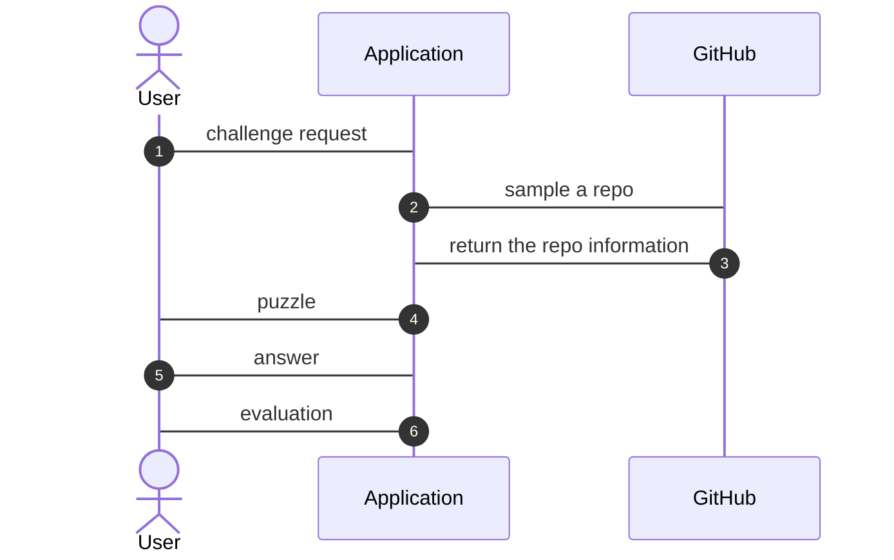

# Class 5: System modelling

```mermaid
sequenceDiagram
    autonumber

    actor user as User
    participant app as Application
    participant github as GitHub

    user -> app: challenge request
    app -> github: sample a repo
    github -> app: return the repo information
    app -> user: puzzle
    user -> app: answer
    app -> user: evaluation
```