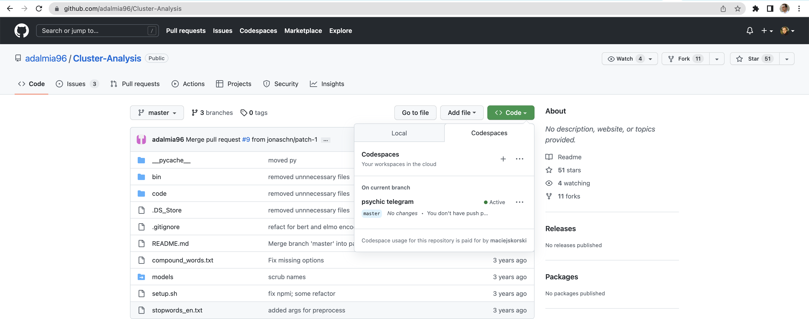
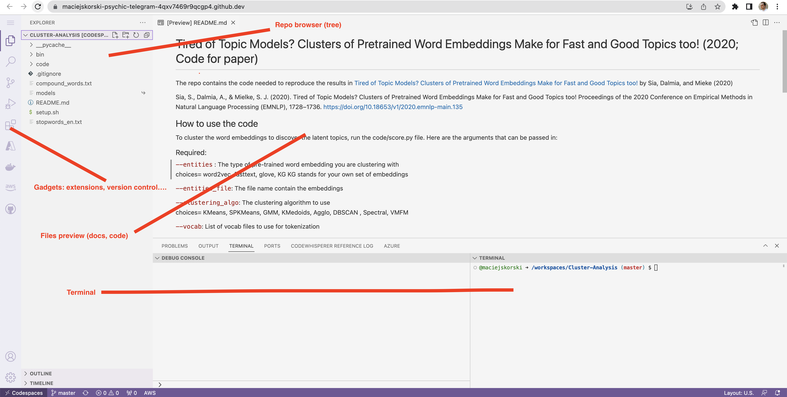
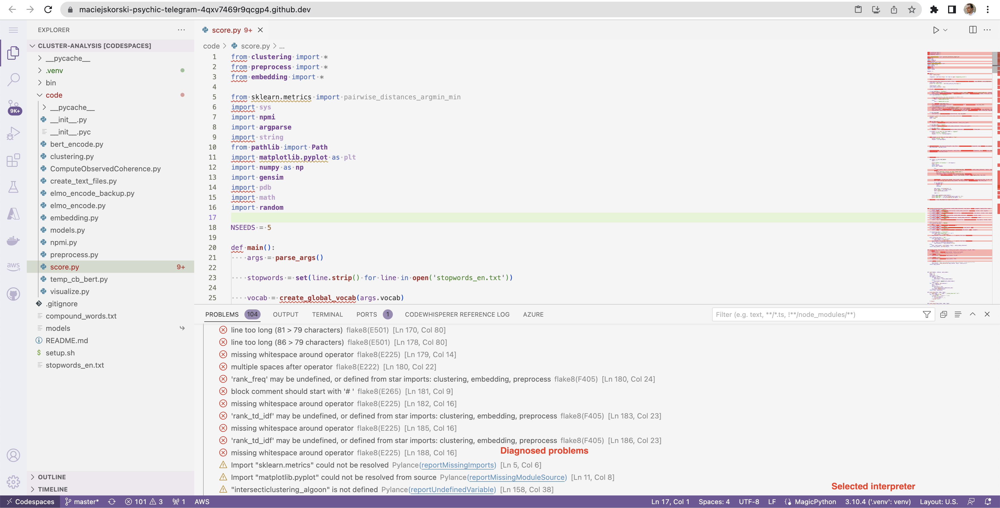

# Class 2: Advanced Debugging

## Development in Cloud

Recently [GitHub lunched cloud-powered developent environments](https://github.com/features/codespaces) called Codespaces.
The environment can be created for every repo and is available as a `Codespaces` tab under the green button `Code`. 


The environment, once built, looks like in the figure below (resembling VS Code).



## Static Code Analysis: Fixing Machine-Learning Repo (Case Study)

We will use static code analysis to fix reproducibility problems of an [implementation from a major NLP conference](https://aclanthology.org/2020.emnlp-main.135.PDF). 
Note: the instruction below assume the use of VS Code locally / Codespaces remote, but you may adapt it to an IDE of your choice.

Fork `https://github.com/maciejskorski/Cluster-Analysis` and open in `Codespaces`. Create and activate a virtual environment in the repo root directory: 
```bash
python -m venv .venv
source .venv/bin/activate
```
Select this version `.venv/bin/python` as the active Python interpreter in the code editor.

Check `settings.json` of the editor to ensure that [Python linters](https://code.visualstudio.com/docs/python/linting) are enabled.
Open the main file: `code/score.py`, you should see about 100 problems reported by Python linters.



Some issues are opinionated (formatting), some are breaking (missing imports in view of no install instructions).
You can also run `pylint --errors-only --recursive=y code` to scan the whole code base.

Fix the reposity only up to the point when the basic call runs:
```bash 
python code/score.py --clustering_algo KMeans --entities word2vec --vocab vocab.txt
```

Try to *fix critical issues* by adding missing packages to the environment with `pip install <missing_package>`.
```{note}
To avoid out-of-memory issues, consider the following optimizations:
* comment out huge modules not used for this call, such as `tensorflow` or `fasttext` 
* adapt the code to work with [a smaller GoogleNews model](https://github.com/eyaler/word2vec-slim/raw/master/GoogleNews-vectors-negative300-SLIM.bin.gz)
```
For meaningful results, store an English dictionary in `vocab.txt` (for instance, copy the content of `/usr/share/dict/words`).

Once the command runs, use `pip freeze > requirements.txt` to export requirements. 
Commit this file and changes to the source code. Congrats!

## Debugging CircleCI with SSH

Add a "build-test" job to the above reposiroty using [CircleCI jobs](https://circleci.com/docs/language-python/).
The job should install dependencies and run a minimal model.


## More examples

Check out this [implementation of ML models used in weather forecast](https://github.com/jieyu97/mvpp).
Run the Python linter. What errors/bugs have you spot?

TBD: more examples
