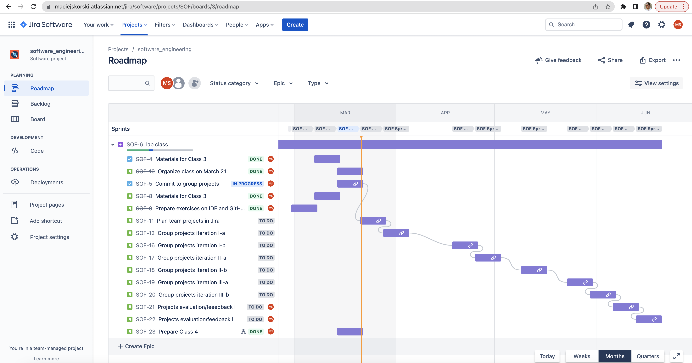

# Software Engineering

## About

Materials for my class “Software Engineering” at University of Warsaw, 2023.

The Goal: *working, tested, and documented minimum viable product iterated few times in a team (Scrum)*.

The materials here aim to demonstrate modern coding tools and good practices.

## Grading

These aspects are evaluated when assigning a final score:

* Team work planning (workload planned and split accordingly)
* Delivery of promised features (minimum viable product)
* Quality of project documentation (GitHub documentation, Jira tasks)
* Quality of software development (code review, tests, CI/CD pipeline)

## Harmonogram

Here is the class harmonogram:

