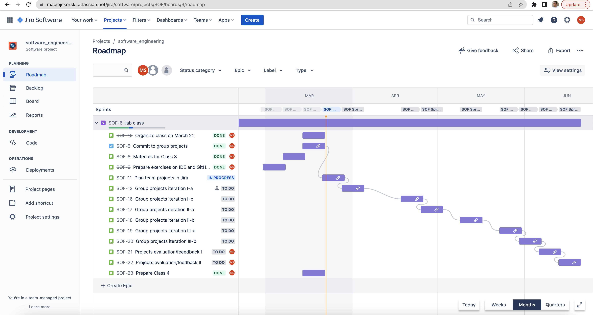

# Software Engineering

Materials for my class “Software Engineering” at University of Warsaw, 2023.

The Goal: *working, tested, and documented minimum viable product iterated few times in a team (Scrum)*.

The materials here aim to demonstrate modern coding tools and good practices.

Here is the class harmonogram:

