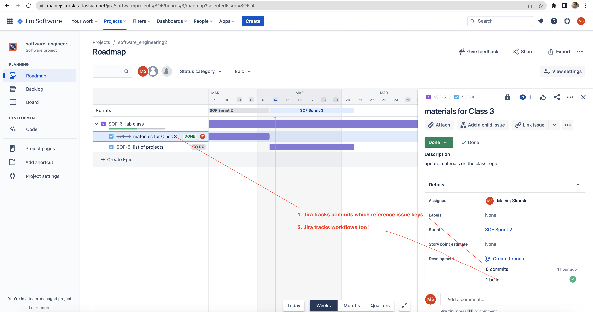

# Class 3: Software project tracking

1. Set up a project repository on GitHub and invite team members

2. Set up a JIRA project (use the Scrum template) and connect to the GitHub repo


```{note}
The Scrum template on Jira presents the roadmap as a "waterfall" of sprints, as shown below.
```

3. Test that GitHub changes are tracked by Jira, by committing with issue keys!


```{note}
Remember to reference Jira's issue keys in git commits, to ensure proper tracking.
```

4. The advantage of Jira over Trello (as of now, March 2023) is Scrum support in its free plan.