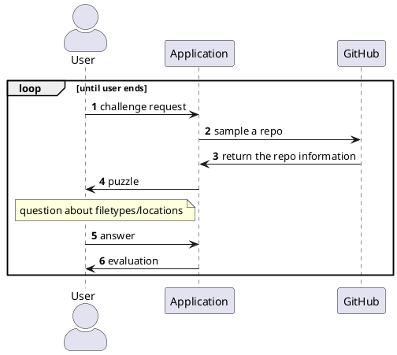
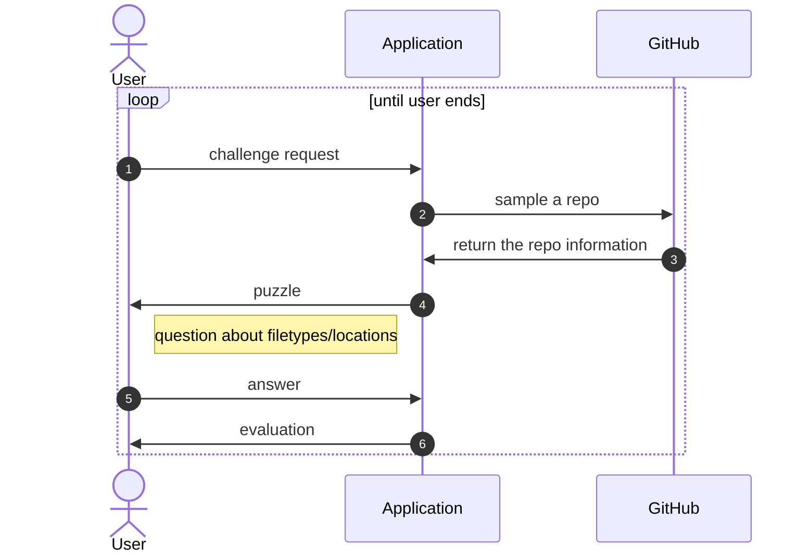
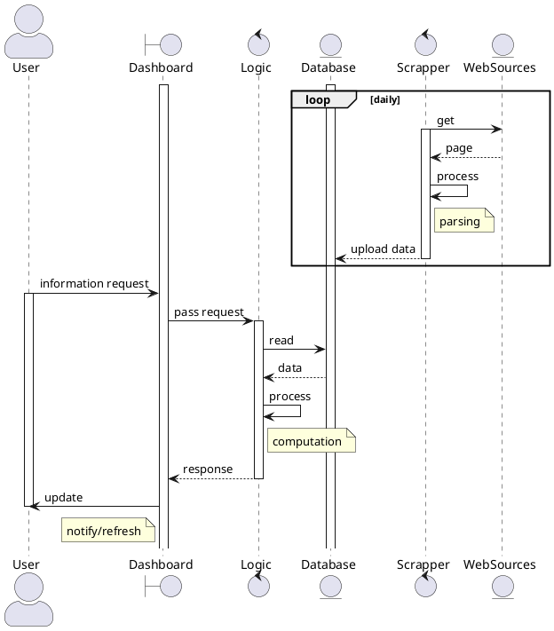

# Class 5: Modelling with UML diagrams

UML diagrams can be created by many tools. Those into graphic design may like drawing tools like [diagrams.net](https://www.diagrams.net/), 
while developers should appreciate *diagrams created from markup descriptions* with [PlantUML](https://plantuml.com/) or simplistic [Mermaid](https://mermaid.js.org/).
It is worth looking into examples shared online, see in particular https://real-world-plantuml.com/ or https://www.planttext.com/.
For more on UML modelling, see dedicated courses like [here](https://nus-cs2103-ay1718s2.github.io/website/book/uml/) or [here](https://www.uml-diagrams.org/).

## Example: GitHub Game

As an exmple, let's model an educational game which challenges users with questions about coding practices based on Github repositories.

With the PlantUML code snippet shown below

we create the following sequence diagram ([test it live here](http://www.plantuml.com/plantuml/uml/ROynJWGn34NxdCBQ7j5lWPOABi01F8Dd9v9ZcyG6iQSdaqW814sYn4_F_r-QO_Ked31S9Sf2DILSNIkyDAg03QBVoJgMrsme3gT7CyuhUbOv7GIQ_GQUiZ_7CcRNx7iiAR6gGOXd7a8WUMq90ERhxk6Gd67TaPdaIb3fBQZvGFhe8ARg30sBCG5sndG0S_9jgUHH1NodWK2MJMiPUN_unkOpMDnkJEDVr0cODWVTfcbao2g0YuR3bfdyqwZTiyx-_tH0QHzK_owYT-IO8NfvI9T-Hk4l)):

A very similar diagram is created by Mermaid, with slightly different syntax  ([test it live here](https://mermaid.live/edit#pako:eNp1UsFqwzAM_RXhc8fuORQGg-0-dstFcZTE4MieLW20pf8-O2mWQplO5r3H05Pki7GhJ9OYTF9KbOnV4ZhwbhlKoUpgnTtKLd8QKyGBZkqAGT5zZSoeMYmzLiILYIyVfInRO4viAj9qRieTdlX25uRdu83fhxBBWZxfmxD3eWVqLdDT8VhbNGAn9J54JEg1fJZdWCNU3dqmgYxz9ARYlDHssluKP8dEoolBJlqE4HgIab4b4d67hmkg6vnsaWc5CIGnQSAMq-kSrTgAdkEFBudJTpHysw_rdv4dEDn_bAt-7Ezf6PUuW1mVOZiZSmDXl4teKtyaMsxMrWnKs6cB1UtrWr4Wab3ux4mtaSQpHYzGHmX7ACt4_QUfk7MV)).

## Example: Web App by Model-View-Controller

The example below illustrates the application of the *Model-View-Controller* framework which separates interface and business logic. To do so, it uses elements with distinguished roles - such as *boundary, control or entity objects*, called  *stereotypes*. The system depicted is a web application which visualizes data scrapped on a daily basis from web resources. 

The code snipppet is shown below

and renders as follows

## More examples

* [an overview of various diagrams for an ATM system](https://github.com/mehedi9339/UML-Diagrams---ATM-System/blob/master/ATM%20System.pdf)
* [a research paper of modelling ETL processes](https://www.sciencedirect.com/science/article/pii/S0950584910001023)
* [an article the Model-View-Controller (MVC) Framework](https://www.cybermedian.com/what-is-model-view-controller-mvc-framework-model-mvc-with-uml-robustness-analysis/)
* [PlantUML documentation](https://plantuml-documentation.readthedocs.io/)