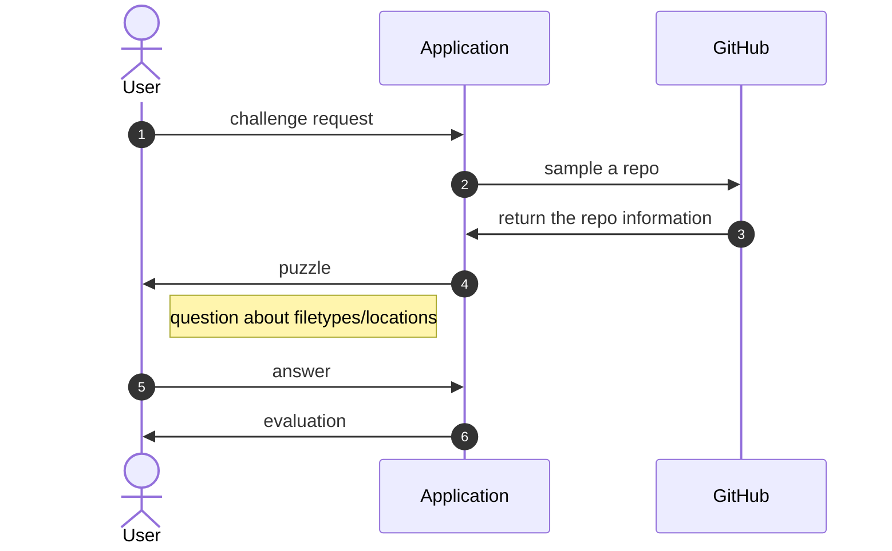

# Class 5: System modelling

UML diagrams can be created by many tools. Those into graphic design may like drawing tools like [diagrams.net](https://www.diagrams.net/), 
while developers should appreciate diagrams created from concise markup descriptions via [PlantUML](https://plantuml.com/) or [Mermaid](https://mermaid.js.org/).

As an exmple, let's model an educational game which challenges users with questions about coding practices based on Github repositories.

```plainuml
@startuml
autonumber

actor User as user
participant "Application" as app
participant "GitHub" as github

user -> app: challenge request
app -> github: sample a repo
github -> app: return the repo information
app -> user: puzzle
note left of app: question about filetypes/locations
user -> app: answer
app -> user: evaluation
@enduml
```


