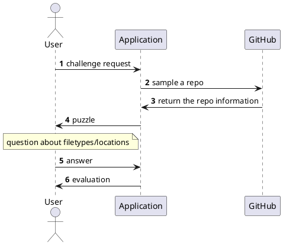

# Class 5: System modelling with UML diagrams

UML diagrams can be created by many tools. Those into graphic design may like drawing tools like [diagrams.net](https://www.diagrams.net/), 
while developers should appreciate diagrams created from concise markup descriptions via [PlantUML](https://plantuml.com/) or [Mermaid](https://mermaid.js.org/).
It is worth looking into examples shared online, in particular on https://real-world-plantuml.com/.

As an exmple, let's model an educational game which challenges users with questions about coding practices based on Github repositories.

With the PlantUML code snippet below

we create the following diagram ([test it live here](http://www.plantuml.com/)):

With only slightly different syntax in Mermaid ([test it live here](https://mermaid.live/))

