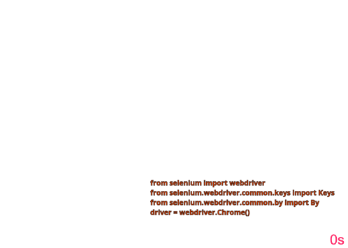

# Class 6: Testing Web Pages

Install [Selenium](https://www.selenium.dev/), a browser automation tool, with `pip install selenium`. 

## Example 1: Test webpage links

Execute interactively (IPython) the following code snippet, to test accessibility of webpage links
```python
from selenium import webdriver
from selenium.webdriver.common.keys import Keys 
from selenium.webdriver.common.by import By
import requests

# access chromedriver, may need to set its binary as trusted - remove quarantine attribute on MacOS
driver = webdriver.Chrome()

# provide website url here
driver.get("http://demo.guru99.com/test/newtours/")

# get all links
all_links = driver.find_elements(By.CSS_SELECTOR,"a")

# check each link if it is broken or not
for link in all_links:
    # extract url from href attribute
    url = link.get_attribute('href')

    # end request to the url and get the result
    result = requests.head(url)

    #if status code is not 200 then print the url (customize the if condition according to the need)
    if result.status_code != 200:
        print(url, result.status_code)
```
Note: the code adapted from [this Python tutorial on Selenium](https://www.educative.io/answers/how-to-find-all-broken-links-using-selenium-webdriver-in-python).
See also [this Java tutorial](https://www.guru99.com/find-broken-links-selenium-webdriver.html).

## Example 2: Test page search

Execute interactively (IPython) the following code snippet, to test searching the class webpage:
```python
from selenium import webdriver
from selenium.webdriver.common.keys import Keys 
from selenium.webdriver.common.by import By

# test if the class page is searchable
driver = webdriver.Chrome()
driver.get("https://maciejskorski.github.io/software_engineering")
elem = driver.find_element(By.CLASS_NAME,"search-button")
elem.click()
elem = driver.find_element(By.NAME,"q") # search boxes are often called "q"
elem.send_keys("UML")
elem.send_keys(Keys.RETURN)

assert "uml diagrams are used to" in driver.page_source
```
```{note}
Interactive content makes scanning harder. In the above example, the search button has to be enabled with `click` before quering.
```

The animation below shows how the browser react to subsequent code steps:



We can also wrap the code as a unit test and run with [pytest](https://pytest.org):
```python
# tests/test_webpage.py

def test_webpage_search():
    from selenium import webdriver
    from selenium.webdriver.common.keys import Keys 
    from selenium.webdriver.common.by import By

    # test if the class page is searchable
    driver = webdriver.Chrome()
    driver.get("https://maciejskorski.github.io/software_engineering")
    elem = driver.find_element(By.CLASS_NAME,"search-button")
    elem.click()
    elem = driver.find_element(By.NAME,"q")
    elem.send_keys("UML")
    elem.send_keys(Keys.RETURN)

    assert "uml diagrams are used to" in driver.page_source
    driver.quit()
```


## More

* [Unoficial Python tutorial for Selenium](https://selenium-python.readthedocs.io/)

* [Converting Chrome Timeline to GIF](https://hospodarets.com/demos/chrome-timeline-to-gif/)
